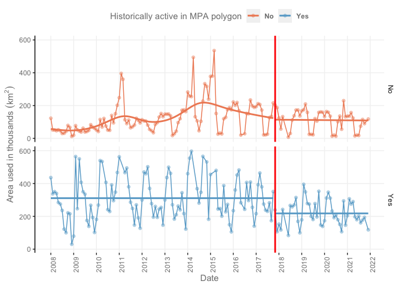

Supplementary information for – The largest fully protected marine area
in North America does not harm industrial fishing
================

This repository stores code to support findings for a submitted
manuscript titled “The largest fully protected marine area in North
America does not harm industrial fishing”. We provide here instruction
to replicate the analysis over sample raw data and reproduce the results
presented in the manuscript and in the supplementary materials.

This readme file is structured in two main chapters:

1.  Replicate the data: explains how data pre-processing occurs and raw
    data sources.

2.  Reproduce the results: explains how manuscript analysis, results,
    and figures are generated.

If reproducing the results using cleaned datasets is the main interest,
the first section can be skipped entirely.

### dafishr package

The `dafishr` package was created to download, wrangle, and analyse
Mexican VMS data. We strongly encourage to read `dafishr` documentation
as well as this document. Many function are from the package and can be
installed through CRAN with:

``` r
install.packages("dafishr")
```

In alternative, the development version can be installed using
`devtools`:

``` r
# install.packages("devtools")
devtools::install_github("CBMC-GCMP/dafishr")
```

## Replicate the data

Raw data from the Mexican Vessel Monitoring system are available through
the “[Datos
Abiertos](https://datos.gob.mx/busca/dataset/localizacion-y-monitoreo-satelital-de-embarcaciones-pesqueras)”
initiative and can be downloaded and wrangled using the `dafishr`
package. Here, we provide a quick intro.

### Step 1. Raw data download

First there are some packages that needs to be installed:

``` r
library(dafishr)
library(readr)
library(dplyr)
library(ggplot2)
library(future.apply)
library(purrr)
library(sf)
library(stringr)
library(CausalImpact)
```

Once installed the packages, we can use `dafishr` functions to download
the last set of data.

``` r
vms_download(2022)
```

The `vms_download` function will create a folder in the working
directory called `VMS-data` that contains a series of `.csv` files from
the Mexican SISMEP data from 2022. These data are raw information on
geolocation of the industrial vessels. Different years can be selected
at once using a vector inside the function. You can find more
information on dafishr documentation `help(vms_download)`.

We can take a look at one of these files.

``` r
glimpse(read_csv('VMS-data/RLMSEP_2022/01. ENERO/01-15 ENE 2022.csv'))
```

    Rows: 525,478
    Columns: 9
    $ Nombre                          <chr> "12 DE DICIEMBRE I", "12 DE DICIEMBRE …
    $ RNP                             <dbl> 54213, 54213, 54213, 54213, 54213, 542…
    $ `Puerto Base`                   <chr> "SALINA CRUZ", "SALINA CRUZ", "SALINA …
    $ `Permisionario o Concesionario` <chr> "PESQUERA PERLA DE SALINA CRUZ, S.A. D…
    $ Fecha                           <chr> "01/01/2022 00:04", "01/01/2022 01:04"…
    $ Latitud                         <dbl> 16.17215, 16.17217, 16.17217, 16.17213…
    $ Longitud                        <dbl> -95.19392, -95.19390, -95.19390, -95.1…
    $ Velocidad                       <chr> "0", "0", "0", "0", "0", "0", "0", "0"…
    $ Rumbo                           <chr> "0", "0", "0", "0", "0", "0", "0", "0"…

The columns are:

- `Nombre` = name of the vessel

- `RNP` = unique vessel registration code

- `Puerto base` = base port where vessels report catch

- `Permisionario o Concesionario` = permit owner name or company name

- `Fecha` = is the date of each geoposition

- `Latitud` = is the WGS83 (4326) latitudinal degree

- `Longitud` = is the WGS83 (4326) longitudinal degree

- `Velocidad` = is the speed of the vessel at the time recorded

- `Rumbo` = is the direction of navigation of the vessel in degrees

There are some evident parsing issues in speed and direction column, all
these are considered and corrected in the pre-processing phase, as well
as other errors.

### Step 2: Preprocessing

The pre-processing goes through a series of
[steps](https://cbmc-gcmp.github.io/dafishr/articles/dafisr.html#downloading-raw-data-on-your-computer)
that are wrapped inside a unique `preprocessing_vms` function. For
simplicity, we use that wrapper here.

The function can be used on a single file, but we can loop it using
`lapply` or even better use a parallel approach:

``` r
## Create a list of files to process
files <- list.files("VMS-data/", recursive = T, pattern = ".csv", full.names = T)

## Set up a parallel session 
plan(multisession, workers = 2) ## Set Cores according to laptop characteristics

## Use the preprocessing_vms function wrapper
future_lapply(files, preprocessing_vms, future.seed = NULL)
```

The `future_lapply` function will loop the `preprocessing_vms` function
on the list of files that were downloaded in the `VMS-data` folder and
save cleaned files in a `.fst` format (see specs
[here](https://www.fstpackage.org/)) in a preprocessed folder that is
automatically created in the working directory.

If you apply the preprocessing on the full scale of the VMS data (from
2008 to 2022) it will take a long time to process on a personal
computer. However, the approach of keeping small chunks of data
separated allows to complete all the analysis without the need of a
significant computing power.

We can load a file to check the results:

``` r
## Load a file to check 
vms <- fst::read_fst("preprocessed/vms_2022_1_1_15_preprocessed.fst")

glimpse(vms)
```

    Rows: 488,781
    Columns: 20
    $ id           <int> 1, 2, 3, 4, 5, 6, 7, 8, 9, 10, 11, 12, 13, 14, 15, 16, 17…
    $ year         <dbl> 2022, 2022, 2022, 2022, 2022, 2022, 2022, 2022, 2022, 202…
    $ month        <dbl> 1, 1, 1, 1, 1, 1, 1, 1, 1, 1, 1, 1, 1, 1, 1, 1, 1, 1, 1, …
    $ day          <int> 1, 1, 1, 1, 1, 1, 1, 1, 1, 1, 1, 1, 1, 1, 1, 1, 1, 1, 1, …
    $ date         <dttm> 2022-01-01 00:04:00, 2022-01-01 01:04:00, 2022-01-01 02:…
    $ vessel_name  <chr> "12 DE DICIEMBRE I", "12 DE DICIEMBRE I", "12 DE DICIEMBR…
    $ RNP          <dbl> 54213, 54213, 54213, 54213, 54213, 54213, 54213, 54213, 5…
    $ port_base    <chr> "SALINA CRUZ", "SALINA CRUZ", "SALINA CRUZ", "SALINA CRUZ…
    $ owner        <chr> "PESQUERA PERLA DE SALINA CRUZ, S.A. DE C.V.", "PESQUERA …
    $ latitude     <dbl> 16.17215, 16.17217, 16.17217, 16.17213, 16.17217, 16.1721…
    $ longitude    <dbl> -95.19392, -95.19390, -95.19390, -95.19390, -95.19390, -9…
    $ speed        <dbl> 0, 0, 0, 0, 0, 0, 0, 0, 0, 0, 0, 0, 0, 0, 0, 0, 0, 0, 0, …
    $ direction    <dbl> 0, 0, 0, 0, 0, 0, 0, 0, 0, 0, 0, 0, 0, 0, 0, 0, 0, 0, 0, …
    $ file_name    <chr> "VMS-data//RLMSEP_2022/01. ENERO/01-15 ENE 2022.csv", "VM…
    $ location     <chr> "port_visit", "port_visit", "port_visit", "port_visit", "…
    $ zone         <chr> "open area", "open area", "open area", "open area", "open…
    $ mpa_decree   <chr> NA, NA, NA, NA, NA, NA, NA, NA, NA, NA, NA, NA, NA, NA, N…
    $ state        <chr> NA, NA, NA, NA, NA, NA, NA, NA, NA, NA, NA, NA, NA, NA, N…
    $ municipality <chr> NA, NA, NA, NA, NA, NA, NA, NA, NA, NA, NA, NA, NA, NA, N…
    $ region       <chr> NA, NA, NA, NA, NA, NA, NA, NA, NA, NA, NA, NA, NA, NA, N…

Column names are now in English, the parsing is now as expected and
several other columns are added:

- `file_name` = the name of the raw file which is useful for future
  references and bug/errors detection

- `location` = has two levels “port_visit”, “at_sea”, meaning that the
  vessels was at port or navigating at sea respectively. Information on
  how this is obtained can be found
  [here](https://cbmc-gcmp.github.io/dafishr/reference/join_ports_locations.html).

- `zone` = can be “open area” meaning that the vessel was outside an MPA
  polygon, or it can be a name of an MPA where the vessels was
  operating. The intersection method with all the MPA in Mexico can be
  found
  [here](https://cbmc-gcmp.github.io/dafishr/reference/join_mpa_data.html).

- `mpa_decree` = the decree of the MPA is coded as “NA” if absent, “PN”
  for National Park, “PMN” for National Marine Park, “RB” Biosphere
  reserve, “APFF” Area of Protection for the Flora and Fauna.

- `state` = the state that the MPA belongs to administratively

- `municipality` = the municipality that the MPA belongs to
  administratively

- `region` = the region that the MPA belongs to administratively

We use this intersection to discriminate vessels that historically were
fishing in Revillagigedo and vessels that did not.

### Step 3: Modeling VMS data

Now that the preprocessing is over, we can model VMS data according to
the speed to have a sense of where vessels were probably fishing.
Modeling details can be found
[here](https://cbmc-gcmp.github.io/dafishr/reference/model_vms.html) and
the full code
[here](https://github.com/CBMC-GCMP/dafishr/blob/HEAD/R/model_vms.R).

Here, we first create a list of all the preprocessed files and then we
loop using `map_dfr` function from the `purrr` package the `model_vms`
function. We add an additional parsing rule to the `RNP` column as when
reading back some of the files it is sometimes parsed as character
drawing an error in the final merge.

The approach can also be parallelized using `furrr` version of the
function: `future_map_dfr`.

``` r
## Create a list of all the files that were preprocessed

files_preprocessed <- list.files("preprocessed/", recursive = T, pattern = ".fst", full.names = T)

## Model files and create a new data frame
vms_modeled  <- map_dfr(files_preprocessed, 
                        function(x)
                              fst::read_fst(x) |>
                              mutate(RNP = as.character(RNP)) |> 
                              model_vms())
```

We can now create a plot of the results to see where the vessels were
active.

``` r
## Plot to observe
vms_modeled |> 
      filter(vessel_state == "hauling") |> 
      st_as_sf(coords = c("longitude", "latitude"), crs = 4326) |> 
      ggplot() +
      geom_sf(pch = ".") +
      geom_sf(data = dafishr::all_mpas, fill = NA, col = "red") +
      coord_sf(xlim = c(min(vms_modeled$longitude), max(vms_modeled$longitude)), 
               ylim = c(min(vms_modeled$latitude), max(vms_modeled$latitude)))
```

## Reproduce the results

The road from raw data to processed files of all the historical data is
long and we are available for questions and details on how to fully
reproduce all the details. Beware, however, that all significant steps
are presented above and now we give all relevant information on data and
analysis to properly assess caveats and limitations of the study.

### Figure 1A: Fishing activity inside Revillagigedo MPA Polygon

Using monthly data that were modeled using the `dafishr` package as
described above, we can now discriminate potential fishing activity
inside MPA polygons and see how it changed over time.

First however, we want to filter only the vessels that had a permit to
fish Tuna, Sharks, and Marlins using longlines or purse seines. This
results in a pelagic fleet, the one that might be mostly affected by the
establishment of Revillagigedo MPA.

We load the permit vessel list from the `dafishr` package, more
description of the dataset is available
[here](https://cbmc-gcmp.github.io/dafishr/reference/pelagiv_vessels_permits.html).

``` r
permits <- dafishr::pelagic_vessels_permits |> 
      mutate(str_split(vessel_name, "\\(")) |> # some names adjustments 
      pull(vessel_name) |> 
      unique()
```

#### Fishing activity dataset

In this repo we make available the results of the preprocessing and
modeling of VMS dataset by the `dafishr` package.

``` r
glimpse(read_rds("outputs/month_vessel_hrs.RDS"))
```

    Rows: 259,310
    Columns: 5
    Groups: year, month, vessel_name [95,048]
    $ year        <dbl> 2008, 2008, 2008, 2008, 2008, 2008, 2008, 2008, 2008, 2008…
    $ month       <dbl> 1, 1, 1, 1, 1, 1, 1, 1, 1, 1, 1, 1, 1, 1, 1, 1, 1, 1, 1, 1…
    $ vessel_name <chr> "A TODA MADRE", "ABEL NOE I", "ABELARDO", "ACAPULCO I", "A…
    $ zone        <chr> "EEZ", "EEZ", "EEZ", "EEZ", "EEZ", "EEZ", "Pacífico Mexica…
    $ hrs         <int> 316, 112, 95, 241, 73, 490, 1, 154, 83, 1, 1, 458, 369, 32…

The dataset is structured by year, month, name of the vessel
(`vessel_name`), the zone of activity and the duration of the potential
fishing activity in hours (`hrs`).

From this dataset we can create: 1) a `vessels_list` of all the vessels
found active in our study area; and 2) a `revi_list` which is all the
vessels that were found active in the Revillagigedo area. The latter was
obtained by intersecting the VMS data modeled with the Mexican MPAs
polygons (available in `dafishr::all_mpas`)

Then, we create a vessels list and a list of all the vessels that were
found to fish in Revillagigedo area.

``` r
vessels_list <- read_rds("outputs/month_vessel_hrs.RDS")  |> 
      pull(vessel_name)  |> 
      unique()

revi_list <- read_rds("outputs/month_vessel_hrs.RDS")  |> 
      filter(str_detect(zone, "Revillagigedo"))  |> 
      pull(vessel_name)  |> 
      unique()
```

We now create a `revispatial` object, by filtering the Revillagigedo
zone, wrangling dates and calculating the effort by dividing the hours
of activity by the number of vessels active.

``` r
revispatial <- readRDS("outputs/month_vessel_hrs.RDS")  |>  
      filter(str_detect(zone, "Revillagigedo"))  |>  
      group_by(year, month, vessel_name)  |> 
      summarise(hrs = sum(hrs))  |> 
      group_by(year, month)  |>  
      summarise(vessel = n_distinct(vessel_name), hrs = sum(hrs/24))  |> 
      mutate(effort = hrs/vessel, 
             date = as.Date(paste0(year, "-", month, "-01"), "%Y-%m-%d"))
```

Finally, we can plot the results. This plot reproduces Figure 1A in the
manuscript.

``` r
revispatial  |>
      mutate(period = ifelse(date < "2017-11-01", "Before", "After")) |>
      ggplot(aes(x = date, y = effort)) +
      geom_point(
            pch = 21,
            fill = "gray80",
            col = "black",
            alpha = .4
      ) +
      labs(x = "",
           y = "Average Fishing Effort (Hrs/N)",
           title = "Fishing activity within MPA polygon") +
      geom_hline(yintercept = 0) +
      geom_vline(xintercept = as.Date("2017-11-01"),
                 col = "red",
                 size = 1) +
      geom_line(aes(group = period)) +
      geom_smooth(
            aes(group = period),
            method = "gam",
            method.args = list(family = Gamma(link = "log")),
            se = F
      ) +
      scale_color_manual(values = c("#FFC107", "#1E88E5")) +
      scale_x_date(date_breaks = "1 year", date_labels = "%Y") +
      theme(
            legend.position = "",
            legend.text = element_text(face = "bold"),
            panel.background = element_rect(fill = NA),
            plot.background = element_rect(fill = NA),
            panel.grid.major = element_line(color = "gray95"),
            text = element_text(color = "gray50"),
            axis.text = element_text(color = "gray50"),
            axis.title = element_text(color = "gray50"),
            axis.text.x = element_text(angle = 90),
            strip.background = element_blank(),
            axis.line.y = element_line(color = "black")
      )
```


### Figure 1B: Catch per Unit of Efforts

We use landings data of the vessels that were using the same permits and
we label them by whether they were using Revillagigedo or not as fishing
area. Then, we create a Catch per Unit of Effort (CPUE) by dividing the
catch by the days declared. We convert the original value that is in kg
to tons, and we calculate an average for all the vessels.

``` r
landings <- dafishr::pacific_landings

landings[c('First_Name', 'Second_Name')] <- str_split_fixed(landings$vessel_name, "\\(", n = 2)

landings_stats <- landings |>   
      ungroup() |>  
      select(date, vessel_name = First_Name, catch, days_declared)  |> 
      mutate(vessel_name = str_trim(vessel_name))  |> 
      filter(vessel_name %in% permits)  |>  
      mutate(revi = ifelse(vessel_name %in% revi_list, "Yes", "No"))  |>  
      mutate(year = lubridate::year(date), month = lubridate::month(date))  |>  
      mutate(CPUE = catch/days_declared) |> 
      group_by(year, month, revi)  |>  
      summarise(CPUE = mean(CPUE/1000))  |> # Convert to tons
      mutate(date = as.Date(paste0(year, "-", month, "-01"), "%Y-%m-%d")) 
```

We can now reproduce Figure 1B of the main text.

``` r
landings_stats  |>
      mutate(period = factor(ifelse(date < "2017-11-01", "Before", "After")),
             revi = factor(revi)) |>
      ggplot(aes(x = date, y = CPUE, group = period)) +
      geom_line(aes(col = revi,
                    fill = revi,
                    group = period)) +
      geom_point(aes(col = revi,
                     fill = revi,
                     group = period),
                 alpha = .4,
                 pch = 21) +
      geom_smooth(
            aes(col = revi,
                fill = revi,
                group = period),
            se = F,
            method = "gam",
            method.args = list(family = Gamma(link = "log"))
      ) +
      labs(x = "",
           y = "Average CPUE (Ton/day)",
           col = "Historically active in MPA polygon",
           fill = "Historically active in MPA polygon") +
      facet_grid(revi ~ .) +
      geom_hline(yintercept = 0) +
      geom_vline(
            xintercept = as.Date("2017-11-01"),
            col = "red",
            linewidth = 1
      ) +
      scale_color_manual(values = c("#ef8a62", "#67a9cf")) +
      scale_fill_manual(values = c("#ef8a62", "#67a9cf")) +
      scale_x_date(date_breaks = "1 year", date_labels = "%Y") +
      theme(
            legend.position = "top",
            legend.text = element_text(face = "bold"),
            panel.background = element_rect(fill = NA),
            plot.background = element_rect(fill = NA),
            panel.grid.major = element_line(color = "gray95"),
            text = element_text(color = "gray50"),
            axis.text = element_text(color = "gray50"),
            axis.title = element_text(color = "gray50"),
            axis.text.x = element_text(angle = 90),
            strip.background = element_blank(),
            axis.line.y = element_line(color = "black")
      )
```


### Figure 1C: Area used by the fleet

To understand how much area was used we rasterized the modeled fishing
area each month for the group of vessels that used Revillagigedo
historically and the ones who did not. The script used to create the
area used dataset is available in the `source` folder of this
repository.

``` r
load("outputs/area_results.RDS") ## Uploading area results

glimpse(areas_results)
```

    Rows: 858
    Columns: 3
    $ date <date> 2008-01-31, 2008-10-15, 2008-10-31, 2008-11-15, 2008-11-30, 2008…
    $ area <dbl> 436031.8, 87223.1, 134241.9, 109843.3, 105466.9, 14283.4, 15408.1…
    $ revi <chr> "yes", "yes", "yes", "yes", "yes", "yes", "yes", "yes", "yes", "y…

The `areas_results` dataset has three columns, featuring date (by month
from 2009 to 2021) the area in km squared and whether data was from the
vessels that historically fished in the Revillagigedo area (
`revi = "yes"` ) and does who did not (`revi = "no"`).

``` r
areas_results %>%
      mutate(revi = factor(
            revi,
            levels = c("no", "yes"),
            labels = c("No", "Yes")
      )) |>
      mutate(year = lubridate::year(date), month = lubridate::month(date)) %>%
      group_by(year, month, revi) %>%
      summarise(area = sum(area) / 1000) %>%
      filter(area < 800) |> # Area outliers that were omitted from the graph
      mutate(date = as.Date(paste0(year, "-", month, "-01"), "%Y-%m-%d")) %>%
      mutate(period = ifelse(date < "2017-11-01", "Before", "After")) |>
      ggplot(aes(x = date, y = area)) +
      geom_line(aes(col = revi,
                    fill = revi,
                    group = period)) +
      geom_point(aes(col = revi,
                     fill = revi,
                     group = period),
                 alpha = .4,
                 pch = 21) +
      geom_smooth(
            aes(col = revi,
                fill = revi,
                group = period),
            se = F,
            method = "gam",
            method.args = list(family = Gamma(link = "log"))
      ) +
      scale_color_manual(values = c("#ef8a62", "#67a9cf")) +
      scale_fill_manual(values = c("#ef8a62", "#67a9cf")) +
      scale_x_date(date_breaks = "1 year", date_labels = "%Y") +
      facet_grid(revi ~ .) +
      geom_vline(xintercept = as.Date("2017-11-01"),
                 col = "red",
                 size = 1) +
      labs(
            x = "Date",
            y = bquote("Area used in thousands "(km ^ 2)),
            col = "Historically active in MPA polygon",
            fill = "Historically active in MPA polygon"
      ) +
      theme(
            panel.background = element_rect(fill = NA),
            plot.background = element_rect(fill = NA),
            panel.grid.major = element_line(color = "gray95"),
            text = element_text(color = "gray50"),
            axis.text = element_text(color = "gray50"),
            axis.text.x = element_text(angle = 90),
            axis.title = element_text(color = "gray50"),
            legend.position = "top",
            legend.text = element_text(face = "bold"),
            strip.background = element_blank(),
            axis.line.y = element_line(color = "black")
      )
```



### Figure 1D, E: Raster of before/after

The raw script that can be applied to a full dataset processing is
available in the `source` folder. Here, we provide the resulting rasters
from before and after and explain the Normalized Fishing Index (NFI)
calculation and reproduce the figure in main text.

We do the calculations separately for the fleet that was active in
Revillagigedo, and for the fleet that was never active there.

#### Vessels active in Revillagigedo

First we upload all the data needed for the map figure.

``` r
estpa <- sf::st_read("data/eastern_pacific.gpkg")
EEZ <- dafishr::mx_eez_pacific
Revimpa <- dafishr::all_mpas %>% 
      filter(str_detect(NOMBRE, "Revillagigedo"))

raster_after <- read_rds("rasters/raster_after_revilla_vessels.RDS")
raster_before <- read_rds("rasters/raster_before_revilla_vessels.RDS")
```

We then use `raster_after` and `raster_before` to calculate the NFI.

As a first step for the NFI calculation we need to substitute NA with
0s.

``` r
# #replacing NA's by zero
raster_before[is.na(raster_before[])] <- 0 
raster_after[is.na(raster_after[])] <- 0 
```

Then we calculate the index using the formula below:

``` r
NFI <- (raster_after - raster_before) / (raster_after + raster_before)
```

We can then create a `NFI_gain` and `NFI_loss` objects representing the
area gained and the area loss, respectively.

``` r
NFI_gains <- NFI>0
NFI_loss <- NFI<0
```

To visualize the resulting rasters we can transform them to points and
then to a dataframe to be plotted with `ggplot2`.

``` r
# convert to a df for plotting in two steps,
# First, to a SpatialPointsDataFrame
NFI_sp <- raster::rasterToPoints(NFI, spatial = TRUE)
# Then to a 'conventional' dataframe
NFI_sp  <- data.frame(NFI_sp) %>% 
      mutate(type = ifelse(layer >= 0, "Increase", "Decrease")) %>%  
      mutate(type = ifelse(layer == 0, "same", type)) %>%  
      filter(type != "same")
```

We finally can plot the results like so:

``` r
ggplot() +
      geom_tile(data = NFI_sp,
                aes(
                      x = x,
                      y = y,
                      col = layer,
                      fill = layer
                ),
                alpha = 0.9) +
      geom_sf(data = EEZ, fill = NA, color = "black") +
      geom_sf(
            data = Revimpa,
            fill = NA,
            col = "black",
            linetype = 2,
            alpha = .2
      ) +
      coord_sf() +
      #facet_grid(~type) +
      scale_fill_gradient2(
            name = "NFI",
            high = "#67a9cf",
            mid = "#f7f7f7",
            low = "gray90",
            na.value = 0,
            guide = guide_colourbar(direction = "horizontal",
                                    title.position = "top")
      ) +
      scale_color_gradient2(
            name = "NFI",
            high = "#67a9cf",
            mid = "#f7f7f7",
            low = "gray90",
            na.value = 0,
            guide = guide_colourbar(direction = "horizontal",
                                    title.position = "top")
      ) +
      theme_void() +
      theme(legend.position = "bottom",
            legend.title.align = 0.5)
```

We can do the same for the vessels how never fished in Revillagigedo to
obtain Figure 1E.

``` r
estpa <- sf::st_read("data/eastern_pacific.gpkg")
EEZ <- dafishr::mx_eez_pacific
Revimpa <- dafishr::all_mpas %>% 
      filter(str_detect(NOMBRE, "Revillagigedo"))

raster_after <- read_rds("rasters/raster_after_NOTrevilla_vessels.RDS")
raster_before <- read_rds("rasters/raster_before_NOTrevilla_vessels.RDS")

# #replacing NA's by zero
raster_before[is.na(raster_before[])] <- 0 
raster_after[is.na(raster_after[])] <- 0 

# convert to a df for plotting in two steps,
# First, to a SpatialPointsDataFrame
NFI_sp <- raster::rasterToPoints(NFI, spatial = TRUE)
# Then to a 'conventional' dataframe
NFI_sp  <- data.frame(NFI_sp) %>% 
      mutate(type = ifelse(layer >= 0, "Increase", "Decrease")) %>%  
      mutate(type = ifelse(layer == 0, "same", type)) %>%  
      filter(type != "same")


ggplot() +
      geom_tile(data = NFI_sp,
                aes(
                      x = x,
                      y = y,
                      col = layer,
                      fill = layer
                ),
                alpha = 0.9) +
      geom_sf(data = EEZ, fill = NA, color = "black") +
      geom_sf(
            data = Revimpa,
            fill = NA,
            col = "black",
            linetype = 2,
            alpha = .2
      ) +
      coord_sf() +
      #facet_grid(~type) +
      scale_fill_gradient2(
            name = "NFI",
            high = "#ef8a62",
            mid = "#f7f7f7",
            low = "gray90",
            na.value = 0,
            guide = guide_colourbar(direction = "horizontal",
                                    title.position = "top")
      ) +
      scale_color_gradient2(
            name = "NFI",
            high = "#ef8a62",
            mid = "#f7f7f7",
            low = "gray90",
            na.value = 0,
            guide = guide_colourbar(direction = "horizontal",
                                    title.position = "top")
      ) +
      theme_void() +
      theme(legend.position = "bottom",
            legend.title.align = 0.5)
```

## Causal Impact

The Causal Impact analysis results can be reproduced using the
`causalimpact` package.

We load all the data needed:

``` r
load(file = "outputs/area_results.RDS")

landings <- readRDS("outputs/pacific_landings.RDS") 

landings[c('First_Name', 'Second_Name')] <- str_split_fixed(landings$vessel_name, "\\(", n = 2)


revispatial <- readRDS("outputs/month_vessel_hrs.RDS") %>%  
      filter(str_detect(zone, "Revillagigedo")) %>%  
      group_by(year, month, vessel_name) %>% 
      summarise(hrs = sum(hrs)) %>% 
      group_by(year, month) %>%  
      summarise(vessel = n_distinct(vessel_name), hrs = sum(hrs)) %>% 
      mutate(effort = hrs/vessel, 
             date = as.Date(paste0(year, "-", month, "-01"), "%Y-%m-%d"))
```

After having all the data ready we prepare them for the Causal Impact
analysis transforming them into a time series object.

Here, we show the analysis for the fishing activity in the Revillagigedo
polygon that corresponds to figure 1A in main text.

``` r
x <- revispatial %>%  
      as.data.frame() %>% 
      mutate(time = 1:length(date))

tomtx <- x %>% ungroup() %>% dplyr::select(effort, time)

revi_CI_mtx <- as.ts(as.matrix(tomtx), frequency = 1)


dates <- x %>% ungroup() %>%  pull(date)

tomod <- zoo(revi_CI_mtx, dates)
tomod

tt <- seq(min(dates), max(dates), "month")

tomod <- merge(tomod, zoo(, tt), fill = 0)

tomod$time <- 1:length(tomod$time)
tomod$effort <- (tomod$effort)
pre.period <- as.Date(c("2008-01-01", "2017-11-01"))
post.period <- as.Date(c("2017-12-01", "2021-12-31"))


impact <- CausalImpact(tomod, pre.period, post.period, 
                       model.args = list(niter = 1000, nseasons = 30, season.duration = 2))

(revilla_hrs <- plot(impact) +
            labs(subtitle = "Fishing activity inside the Revillagigedo polygon", y = "") +
            scale_x_date(breaks = "1 year", date_labels = "%Y") +
            theme(panel.grid = element_blank(), 
                  text = element_text(size=11),
                  strip.background = element_rect(color = NA, fill = NA)))


summary(impact, "report")
```

A full script that features the analysis for all figures is available in
the `source` folder called `CausalImpact.R`.
